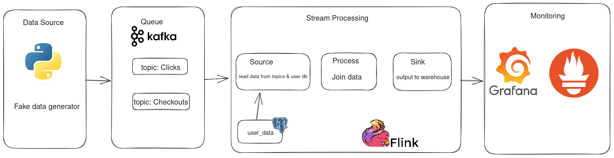

## Overview

This project is built to demonstrate fundamental concepts in streaming such as data flow, watermarking...

Basically, there is a container, which simulate an e-commerce website, generates fake click and checkout events. This pipeline extracts data from Kakfa topics. Some joins are applied to enrich data, then data is sunk into the data warehouse for reporting.

### Data Visualization

### Data Architecture

1. A container is running to generate click and checkout data
2. Event data are then sent to corresponing topics
3. Apache Flink is used for stream processing:
    1. Checkout data are enriched with user information data (querying from Postgres)
    2. Click data are stored only 1 hour in order to join with checkout data
    3. Enriched and attributed data are finally sunk to the data warehouse
4. Monitoring metrics are pulled by Prometheus then visualized in Graphana

## Prerequisites

Directions or anything needed before running the project.

1. git
2. Docker

## How to Run This Project

1. git clone https://github.com/trisdoan/streaming_project.git
2. cd streaming_project
3. make up (spin up containers)
4. make run-etl (run python script in Flink)
5. make flink-ui (access Flink UI)

## Lessons Learned

It's good to reflect on what you learned throughout the process of building this project. Here you might discuss what you would have done differently if you had more time/money/data. Did you end up choosing the right tools or would you try something else next time?

Reference
Machado, J. (2023, May 15). Data Engineering Project: Stream Edition · Start Data Engineering. Start Data Engineering, from https://www.startdataengineering.com/post/data-engineering-project-for-beginners-stream-edition/

## Contact

Please feel free to contact me if you have any questions at: LinkedIn, Twitter
